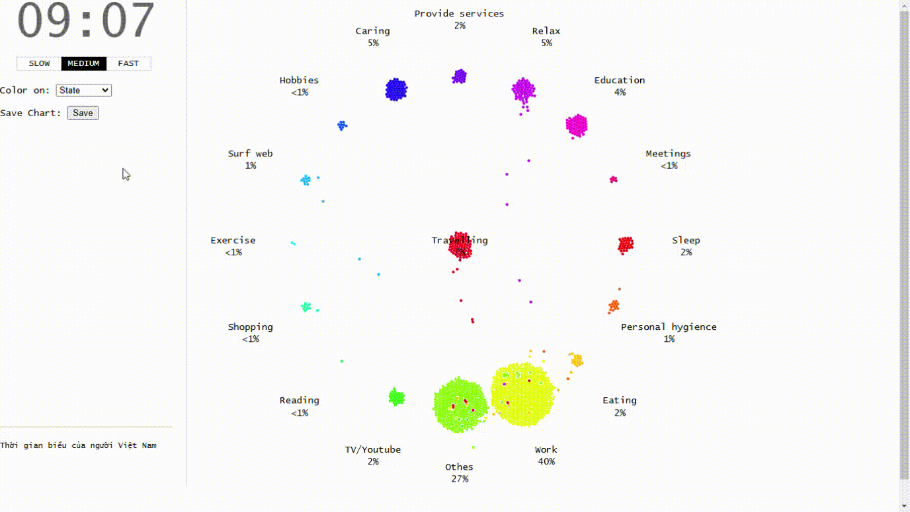

<h1>Vietnamese daily 2022 visualization</h1>
<h2>Introduction</h2>

This is a python code to visualize a typical day of a Vietnamese based on data collected in 2022.

<h2>Result</h2>

  
results when running the program

  

